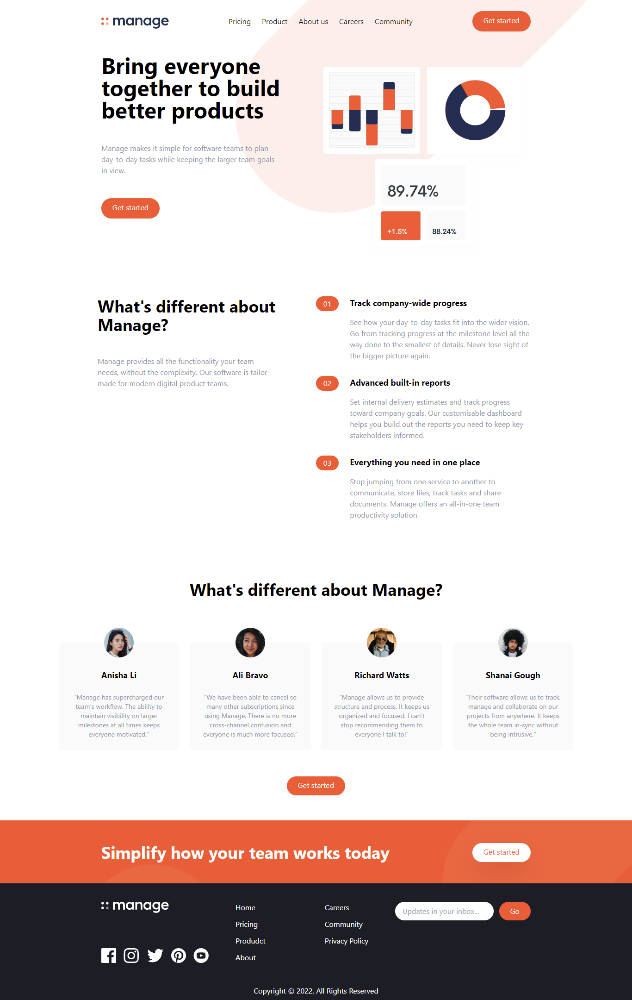

# Frontend Mentor - Manage landing page solution

This is a solution to the [Manage landing page challenge on Frontend Mentor](https://www.frontendmentor.io/challenges/manage-landing-page-SLXqC6P5). Frontend Mentor challenges help you improve your coding skills by building realistic projects. 

## Table of contents

- [Overview](#overview)
  - [The challenge](#the-challenge)
  - [Screenshot](#screenshot)
  - [Links](#links)
- [My process](#my-process)
  - [Built with](#built-with)
  - [What I learned](#what-i-learned)
  - [Continued development](#continued-development)
  - [Useful resources](#useful-resources)
- [Author](#author)
- [Acknowledgments](#acknowledgments)

## Overview
This is a solution to the [Manage landing page challenge on Frontend Mentor](https://www.frontendmentor.io/challenges/manage-landing-page-SLXqC6P5). Frontend Mentor challenges help you improve your coding skills by building realistic projects. 

### The challenge

Users should be able to:

- View the optimal layout for the site depending on their device's screen size
- See hover states for all interactive elements on the page
- See all testimonials in a horizontal slider
- Receive an error message when the newsletter sign up `form` is submitted if:
  - The `input` field is empty
  - The email address is not formatted correctly

### Screenshot

### Links

- Solution URL: [https://github.com/codersuresh/manage-landing-page-master](https://github.com/codersuresh/manage-landing-page-master)
- Live Site URL: [https://codersuresh.github.io/manage-landing-page-master](https://codersuresh.github.io/manage-landing-page-master)

## My process
- Set up the project with github

- Read the README.md file and have a look around the project

- Get colors, fonts etc from the style-guide.md file

- Set up project/file architecture 

- Start coding!

### Built with

- HTML5 markup
- Tailwind CSS
- Mobile-first workflow

### What I learned

This is the first time I used tailwindcss. 
I learned to 
- setup tailwind using npm
- configure custom properties like screen size and colors

## Author

- Website - [Coder Suresh](https://codersuresh.github.io/)
- Frontend Mentor - [@codersuresh](https://www.frontendmentor.io/profile/codersuresh)
- Twitter - [@codersuresh](https://www.twitter.com/codersuresh)